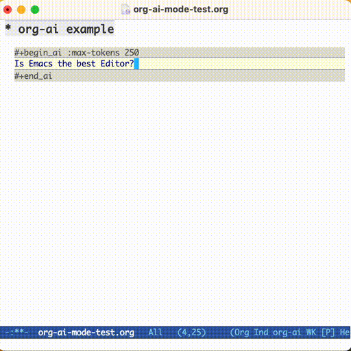

# org-ai

Minor mode for Emacs org-mode that provides access to OpenAI API's. Inside an org-mode buffer you can
- use ChatGPT to generate text
- generate images with a text prompt using DALL-E
- generate image variations of an input image

Implemented in pure Emacs Lisp, no external dependencies required (except currently for image variations[^1]).

_Note: In order to use this you'll need an [OpenAI account](https://platform.openai.com/) and you need to get an API token. As far as I can tell, the current usage limits for the free tier get you pretty far._

## Table of Contents

- [Features](#features)
- [Demos](#demos)
    - [ChatGPT in org-mode](#chatgpt-in-org-mode)
    - [DALL-E in org-mode](#dall-e-in-org-mode)
    - [Image variations](#image-variations)
- [Options](#options)
- [Setup](#setup)
    - [Melpa](#melpa)
    - [Straight.el](#straightel)
    - [Manual](#manual)
- [FAQ](#faq)

## Features

### `#+begin_ai...#+end_ai` special blocks

Similar to org-babel, these blocks demarcates input (and for ChatGPT also output) for the AI model. You can use it for AI chat, text completion and text -> image generation. See [options](#options) below for more information.

Create a block like

```org
#+begin_ai
Is Emacs the greatest editor?
#+end_ai
```

and press `C-c C-c`. The Chat input will appear inline and once the response is complete, you can enter your reply and so on. See [the demo](#chatgpt-in-org-mode) below. You can press `C-g` while the ai request is running to cancel it.

Images will appear underneath the ai block inline. Images will be stored (together with their prompt) inside `org-ai-image-directory` which defaults to `~/org/org-ai-images/`.

### Image variation

You can also use an existing image as input to generate more similar looking images. The `org-ai-image-variation` command will prompt for a file path to an image, a size and a count and will then generate as many images and insert links to them inside the current `org-mode` buffer. Images will be stored inside `org-ai-image-directory`. See the [demo](#image-variations) below.

[For more information see the OpenAI documentation](https://platform.openai.com/docs/guides/images/variations). The input image needs to be square and its size needs to be less than 4MB. And you currently need curl available as a command line tool[^1].

[^1]: __Note:__ Currenly the image variation implementation requires a command line curl to be installed. Reason for that is that the OpenAI API expects multipart/form-data requests and the emacs built-in `url-retrieve` does not support that (At least I haven't figured out how). Switching to `request.el` might be a better alternative. If you're interested in contributing, PRs are very welcome!

## Demos

### ChatGPT in org-mode

```org
#+begin_ai
Is Emacs the greatest editor?
#+end_ai
```



You can continue to type and press `C-c C-c` to create a conversation. `C-g` will interrupt a running request.


### DALL-E in org-mode

```org
#+begin_ai :image :size 256x256
Hyper realistic sci-fi rendering of super complicated technical machine.
#+end_ai
```


### Image variations


## Options

The `#+begin_ai...#+end_ai` block can take the following options.

### For ChatGPT
By default, the content of ai blocks are interpreted as messages for ChatGPT. Text following `[ME]:` is associated with the user, text following `[AI]:` is associated as the model's response.

- `:max-tokens number` - number of maximum tokens to generate (default: 120)
- `:temperature number` - temperature of the model (default: 1)
- `:top-p number` - top_p of the model (default: 1)
- `:frequency-penalty number` - frequency penalty of the model (default: 0)
- `:presence-penalty` - presence penalty of the model (default: 0)

### For DALL-E

When you add an `:image` option to the ai block, the prompt will be used for image generation.

- `:image` - generate an image instead of text
- `:size` - size of the image to generate (default: 256x256, can be 512x512 or 1024x1024)
- `:n` - the number of images to generate (default: 1)

### Other text models

The older completion models can also be prompted by adding the `:completion` option to the ai block.

- `:completion` - instead of using the chatgpt model, use the completion model
- `:model` - which model to use, see https://platform.openai.com/docs/models for a list of models

For the detailed meaning of those parameters see the [OpenAI API documentation](https://platform.openai.com/docs/api-reference/chat).

## Setup

### Melpa

The PR for [melpa is currently pending](https://github.com/melpa/melpa/pull/8429)

### Straight.el

```elisp
(straight-use-package
 '(org-ai :type git :host github :repo "rksm/org-ai"
          :local-repo "org-ai"
          :files ("*.el" "README.md")))
```

### Manual

Checkout this repository.

```sh
git clone
https://github.com/rksm/org-ai
```

Then, if you use `use-package`:

```elisp
(use-package org-ai
  :load-path (lambda () "path/to/org-ai")
  :commands (org-ai-mode)
  :custom
  (org-ai-openai-api-token "<ENTER YOUR API TOKEN HERE>")
  :init
  (add-hook 'org-mode-hook #'org-ai-mode))
```

or just with `require`:

```elisp
(add-to-list 'load-path "path/to/org-ai")
(require 'org)
(require 'org-ai)
(add-hook 'org-mode-hook #'org-ai-mode)
(setq org-ai-openai-api-token "<ENTER YOUR API TOKEN HERE>")
```

## FAQ

### Is this OpenAI specfic?

Currently yes but once there are more high-quality APIs available I'm planning on supporting those as well.


